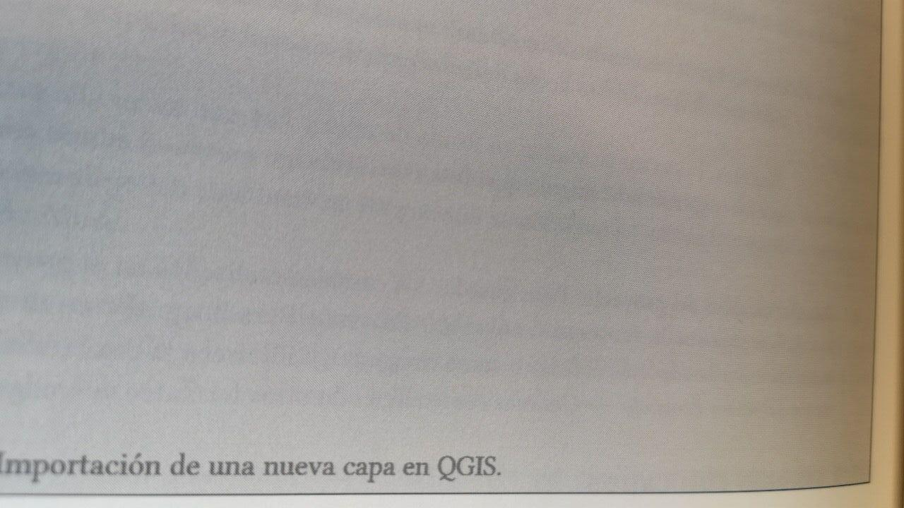
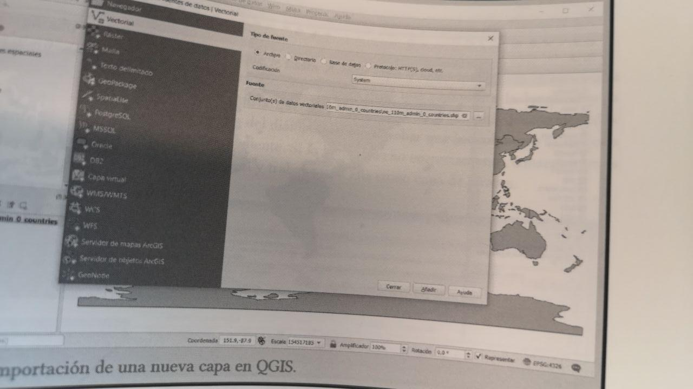
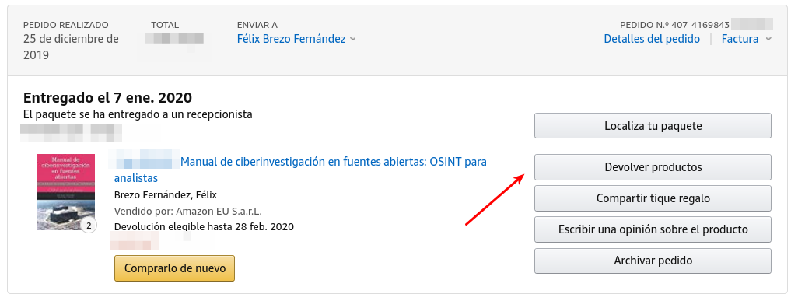

# Devolución de ediciones impresas de forma incorrecta del «Manual de ciberinvestigación de fuentes abiertas: OSINT para analistas»

Este documento tiene el objetivo de presentar lo sucedido y presentar las unstrucciones para la devolución de aquellas copias mal impresas del «Manual de ciberinvestigación de fuentes abiertas: OSINT para analistas», publicado el 25 de diciembre de 2019.
En este documento queremos ayudar a los lectores afectados a solicitar el reembolso del coste del libro con la mayor celeridad posible y el menor impacto para cada uno de vosotros.

## ¿Qué ha pasado?

El pasado 25 de diciembre de 2019 publicábamos por primera vez en la plataforma de Amazon de la primera edición del «Manual de ciberinvestigación de fuentes abiertas: OSINT para analistas». Se trata de un manual en el que recogemos ejercicios, técnicas y tips que utilizamos en nuestras clases para explicar las posibilidades que ofrecen diferentes herramientas para obtener información de fuentes abiertas. Solicitamos entonces nuestra copia de prueba y estábamos bastante satisfechos con la impresión con lo que el manual fue puesto a disposición del gran público a un precio de 9,60€ más IVA.

Aunque las ventas del manual hasta la semana pasada habían sido escasas porque no lo habíamos publicitado (apenas media docena), estas se dispararon tras anunciarlo en redes sociales. Por desgracia, muchos lectores nos han notificado que esta tirada está llegando con algunos errores de impresión que hace que falten, por ejemplo, algunas imágenes.
Por este motivo, ofrecemos nuestras más sinceras disculpas a todas las personas que han recibido el material incorrectamente y queremos aprovechar este correo para ser lo más transparente posible con respecto a los pasos que estamos dando para solucionarlo.

## ¿Cómo saber si tengo una impresión incorrecta?

Las impresiones incorrectas se identifican fácilmente porque a partir de la figura 81 (del capítulo 7 en adelante) hay unas cuantas fotografías que no aparecen. Se puede comprobar porque solamente se ve el marco gris que rodea a la imagen. Estos libros son defectuosos.

| Ejemplo de imagen en libro defectuoso | Ejemplo de imagen correcta |
| ------------- | ------------- |
|  |  |

## ¿Qué pasos se han dado para mitigar el impacto de la impresión?

Desde que se tuvo constancia del problema se han seguido diferentes pasos:

1. En el momento en que nos notificaron la incidencia, cancelamos la impresión de nuevas unidades para contener el problema. Ese es el motivo por el que el libro no está disponible para la venta en Amazon desde la tarde-noche del domingo 19. 
2. Se ha procedido a una nueva revisión de los archivos de edición y su registro en el sistema de Autoedición de Amazon KDP. Ya hemos solicitado nuevas copias de prueba que nos llegarán a los autores el fin de semana del 24 al 26 de enero. Si esta impresión es satisfactoria, volveremos a poner a la venta el libro nuevamente para que pueda ser adquirido por los lectores.
3. No procederemos a la publicación del nuevo manuscrito hasta que no tengamos la garantía de que el manual está publicado conforme a los estándares que esperábamos. Por este motivo, aún tardaremos unos días en volverlo a tener disponible hasta que confirmemos que lo estándares de calidad de la nueva impresión están a la altura de lo que esperamos nosotros y de lo que esperáis vosotros.

## ¿Qué métodos de devolución del material están disponibles?

Dado que Amazon no nos facilita el listado de compradores, difundiremos a todas las personas que habéis contactado con nosotros por redes sociales o por otros canales esta guía. 
También la colgaremos en los principales hilos que se han generado en las distintas redes sociales para darle la máxima difusión posible.
En el caso de que conozcas a algún lector al que no le ha llegado, sí que te agradeceríamos que le hicieras llegar este comunicado.

Por este motivo, los pasos para solicitar el reembolso:

1. Comprobar que el manual ha sido impreso correctamente verificando si faltan figuras a partir de la figura 81.
2. Sacar varias fotografías del contenido mostrado.
3. Loguearse en Amazon y seleccionar la opción de `Devoluciones y Pedidos` en el menú de navegación superior.

4. Ir hasta el pedido en el que se encuentra el producto adquirido que se quiere devolver y pinchar en `Devolver productos`.

5. Hecho esto, se podrá seleccionar el número de objetos a devolver y los motivos de la devolución. Proponemos como texto de referencia el siguiente:
    
> Error en la impresión de la copia que presenta diversos problemas de formato entre los que se encuentra la ausencia de algunas imágenes a partir de la Figura 81.
    
6. Acto seguido, se podrá elegir el método de devolución. El más sencillo es el uso de `Celeritas - No se necesita imprimir etiqueta ni caja para empaquetarlo` dado que es suficiente con presentarte en la oficina con el libro y entregarlo. Para otros supuestos, se puede obtener más información en la página de atención al cliente, dado que es necesario imprimir una etiqueta de devolución.
7. A partir de ese momento, puedes seguir el estado del proceso de devolución y reembolso del dinero en la sección de `Mis pedidos` en tu cuenta de Amazon.
    
Se puede encontrar más información oficial sobre cómo realizar desembolsos en Amazon.es en su guía de atención al cliente disponible [aquí](https://www.amazon.es/gp/help/customer/display.html/?nodeId=201824330), pero quedamos a vuestra disposición también para daros soporte en cualquier trámite adicional que sea necesario llevar a cabo por los canales habituales.

Queremos recordar por nuestra parte que el período para efectuar las devoluciones es límitado con lo que recomendamos no dejar esta tarea para el final.
    
## ¿Por qué se ha tardado unos días en informar de este mecanismo de devolución y no se ha recomendado desde el principio?

Desde el domingo por la tarde, ha sido nuestra prioridad resolver el problema con la mayor celeridad posible y causando el menor impacto para todas las personas que lo han adquirido con problemas.
Hemos estado en contacto telefónico con responsables de la compañía desde entonces y queremos agradecer en todo momento las buenas formas, tratando de buscar mecanismos alternativos a la devolución individual de los afectados.
Muy a nuestro pesar, no hemos podido encontrar una solución alternativa.

## ¿Qué otro tipo de medidas se han contemplado como alternativa?

A este respecto, sí que queremos dejar constancia de que la opción primera para gestionar el incidente pasaba por solicitar el reenvío del material a los lectores que lo adquirieron en Amazon sin coste para vosotros.
La respuesta ha sido la siguiente:

> lun., 20 ene. 16:06  
> 
> …
> 
> Hemos recibido su mensaje proveniente de otro departamento de Amazon; entiendo que ha actualizado el contenido de su libro y le gustaría que los clientes que hayan comprado una copia, reciban el contenido actualizado.
> 
> Le comento que de momento no contamos con la opción de enviar el contenido actualizado de libros tapa blanda a los lectores. Tome en cuenta que cada lector cuenta con la opción de reportar al equipo de soporte al cliente de Amazon cuando consideren que sus productos tienen errores; de este modo, Amazon puede reemplazar las copias o dar un reembolso.
>     
> …

Ante dicha consulta, planteamos la posibilidad de que se compartiera con nosotros el listado de personas que lo habían recibido, pero esto no ha sido posible por política corporativa. 
En este caso, Amazon nos ha informado de que no es posible tramitar esta petición de esta manera y que tampoco puede compartir con nosotros información sobre quiénes lo han comprado o sus domicilios. 

> mar., 21 ene. 7:00
> 
> …
> 
> Gracias por contactar Amazon KDP, es un placer atender su consulta.
> 
> Referente a su consulta, le comento que no es posible enviar el libro actualizado a todas las personas que han comprado su libro.
> 
> Los datos de los compradores son privados y no pueden ser compartidos con los vendedores.
> 
> …
    
En parte entendemos la aproximación, pero lamentamos que esto conlleve que la reclamación de las impresiones correctas se tenga que realizar individualmente por los compradores y lectores. 

## Las más sinceras disculpas

No queríamos concluir sin pedir nuevamente disculpas por este problema que hemos intentado gestionar de la forma más transparente posible.
En lo personal, nos sabe especialmente mal y por eso nos ha costado disgustos y malos ratos durante estos últimos días que deberían haber sido de celebración y agradecimientos.
Somos conscientes del revuelo que ha causado, primero, la publicación del manual colocándolo en las listas de los más vendidos de Amazon (¡piel de gallina!) y después con esta incidencia de impresión que lamentamos tan profundamente.
No tenemos palabras para agradecer la confianza depositada y la comprensión que habéis manifestado muchos de vosotros por un problema que esperamos que no se vuelva a repetir.

Humildemente, **perdón**. 
Cariñosamente, **gracias**.

Atentamente,

_Yaiza Rubio y Félix Brezo_
